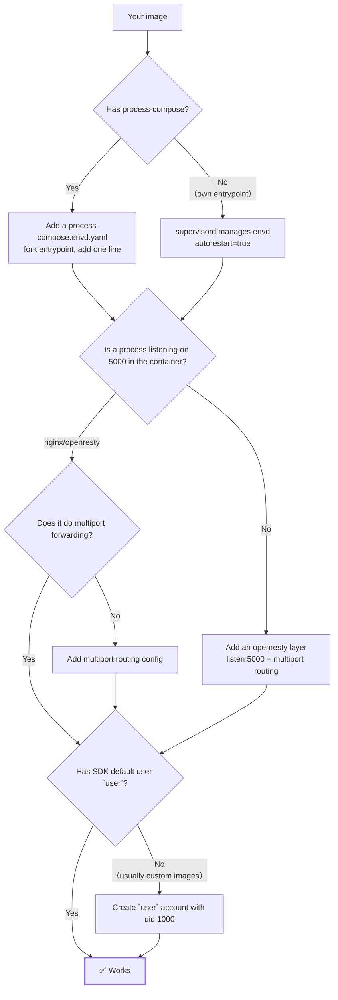

# Porting envd into your own image (full source)

> This doc explains how to port e2b's envd into a custom image built from scratch; all source lives in `e2b-custom-image/`.
> Starting from three forks — "do you have process-compose? / is a process listening on 5000? / does the SDK default user exist?" — it fills in each missing piece.

**Table of contents**

- [Porting envd into your own image (full source)](#porting-envd-into-your-own-image-full-source)
  - [1. No process-compose: run envd under supervisord](#1-no-process-compose-run-envd-under-supervisord)
  - [2. No multiport reverse proxy on 5000: add an openresty layer](#2-no-multiport-reverse-proxy-on-5000-add-an-openresty-layer)
  - [3. SDK default user `user`: a custom image must create it itself](#3-sdk-default-user-user-a-custom-image-must-create-it-itself)
  - [4. Four pitfalls when building an image from scratch](#4-four-pitfalls-when-building-an-image-from-scratch)
  - [5. Porting checklist](#5-porting-checklist)
  - [Appendix: file manifest](#appendix-file-manifest)

---



Every conclusion below was verified against `e2b-custom-image/`: starting from `debian:bookworm-slim`,
installing openresty ourselves, writing the multiport routing ourselves, and managing envd under supervisord,
the full build → local verify → push → template build → sandbox creation flow works, and both
`commands.run` / `files` are usable. The resulting image is 235MB.

See the [Appendix: file manifest](#appendix-file-manifest) for the file list; the source is in this directory — open the matching file directly.

## 1. No process-compose: run envd under supervisord

There is one key requirement: envd must stay alive and be relaunched automatically if it dies. If it dies,
some E2B SDK capabilities of the whole sandbox are lost. You don't need to introduce process-compose for
this — supervisord is enough.

```dockerfile
COPY --from=envd-extract /.fce2b/envd /usr/local/bin/envd
RUN apt-get update && apt-get install -y --no-install-recommends supervisor \
    && rm -rf /var/lib/apt/lists/*
COPY supervisor-envd.conf /etc/supervisor/conf.d/10-envd.conf
```

`supervisor-envd.conf` is below. If your image already uses supervisord, integrating envd is just this single
`COPY` — the main config and the other process definitions don't change a single line:

```ini
[program:envd]
command=/usr/local/bin/envd
autostart=true
autorestart=true
; survives more than 1s counts as a successful start
startsecs=1
; supervisord has no "infinite retry"; give a value too big to ever exhaust (see warning below)
startretries=1000000
stopsignal=TERM
stopwaitsecs=10
; also kill the processes envd forks (the user processes started by commands.run) along with it
stopasgroup=true
killasgroup=true
priority=10
; forward logs to container stdout, don't write to disk (sandboxes are ephemeral)
redirect_stderr=true
stdout_logfile=/dev/fd/1
stdout_logfile_maxbytes=0
```

> **`autorestart=true` alone is not enough — you must also raise `startretries`.**
> supervisord's default is `startretries=3`: after envd fails fast 3 times in a row it enters **FATAL and is
> never relaunched** — exactly the semantics process-compose's `restart: always` explicitly avoids.
> Verified (`/bin/false` + `autorestart=true` + `startretries=3`):
> ```
> t+1s   crashy   BACKOFF   Exited too quickly
> t+4s   crashy   FATAL     Exited too quickly     ← no more retries after this
> ```
> The symptom is "the sandbox is fine for the first few minutes, then every SDK call returns 502" — extremely hard to debug.

A from-scratch image also needs the main config. Three key points:

```ini
[supervisord]
; run in the foreground: required in a container, otherwise PID 1 exits in a second and the container ends
nodaemon=true
logfile=/dev/null
logfile_maxbytes=0

; unix socket: in the sandbox one `supervisorctl status` shows who died and how many times it restarted
[unix_http_server]
file=/var/run/supervisor.sock
chmod=0700

[supervisorctl]
serverurl=unix:///var/run/supervisor.sock

[rpcinterface:supervisor]
supervisor.rpcinterface_factory = supervisor.rpcinterface:make_main_rpcinterface

[include]
files = /etc/supervisor/conf.d/*.conf
```

The entrypoint is down to directory prep + a single `exec`, with **no process-management logic left in it**:

```bash
exec /usr/bin/supervisord -c /etc/supervisor/supervisord.conf -n
```

Use `exec` rather than backgrounding + `wait`: let supervisord be PID 1 so the container's TERM/INT reaches it,
and signal forwarding and zombie reaping for child processes are its job too.

**Three supervisord-specific pitfalls:**

| Pitfall | Consequence |
|---|---|
| A `; comment` at the end of a line | supervisord **does not strip trailing comments**; `autorestart=true  ; auto restart` becomes `true  ; auto restart`. Use whole-line comments only |
| Reverse proxy forgot `daemon off;` | openresty forks to the background on startup, supervisord thinks it exited instantly and restarts it repeatedly |
| socket `chmod=0700` | `supervisorctl` is root-only on purpose: otherwise `user` in the sandbox could run `supervisorctl stop envd` to stop the root-started process. The SDK side must query status with `commands.run(..., user="root")` |

A build-time guard: supervisord has no dry-run like `nginx -t`, so read it with `configparser`
following its own parsing rules (trailing comments not stripped) and assert the key values are literally what
they should be — this incidentally also blocks the first pitfall above:

```dockerfile
RUN python3 -c "import configparser, glob; \
cp = configparser.ConfigParser(interpolation=None); \
cp.read(['/etc/supervisor/supervisord.conf'] + sorted(glob.glob('/etc/supervisor/conf.d/*.conf'))); \
assert cp.get('supervisord', 'nodaemon') == 'true'; \
assert cp.get('program:envd', 'command') == '/usr/local/bin/envd'; \
assert cp.get('program:envd', 'autorestart') == 'true'; \
assert int(cp.get('program:envd', 'startretries')) >= 1000000"
```

> Acceptance must verify "it comes back up after a crash", not just "it's running now". `verify-local.sh` item ⑦:
> `pkill -9 -f /usr/local/bin/envd`, then within 6s port 49983 is listening again, and
> `supervisorctl status envd` is back to **RUNNING** (not FATAL/BACKOFF).
> The second half can't be skipped: supervisord also restarts a few times before hitting FATAL, so watching only the port misses it.
>
> Conversely, judging `RUNNING` needs polling, not a single sample: before `startsecs=1` elapses the status is
> `STARTING`; the sandbox recovers quickly and the first command often lands inside that 1s window — we hit this
> in practice. A single sample misreads a normal `STARTING` as a failure. `BACKOFF` is likewise a transitional
> state; only `RUNNING` / `FATAL` / `EXITED` are terminal.

## 2. No multiport reverse proxy on 5000: add an openresty layer

It must be openresty, not nginx: multiport routing uses `rewrite_by_lua_block` / `ngx.exec`, and the `nginx`
package in the Debian/Ubuntu repos has no lua module. Install from scratch:

```dockerfile
RUN set -eux; \
    apt-get update; \
    apt-get install -y --no-install-recommends ca-certificates curl gnupg; \
    curl -fsSL https://openresty.org/package/pubkey.gpg \
        | gpg --dearmor -o /usr/share/keyrings/openresty.gpg; \
    echo "deb [arch=amd64 signed-by=/usr/share/keyrings/openresty.gpg] \
http://openresty.org/package/debian bookworm openresty" \
        > /etc/apt/sources.list.d/openresty.list; \
    apt-get update; \
    apt-get install -y --no-install-recommends openresty; \
    apt-get purge -y --auto-remove gnupg; \
    rm -rf /var/lib/apt/lists/*
```

The config root it installs is `/etc/openresty/` (not `/etc/nginx/`), and the binary is
`/usr/local/openresty/bin/openresty`. Its default `nginx.conf` lacks temp directories like
`client_body_temp`, so you must `mkdir` them yourself (under `/var/lib/openresty/`, specifying the prefix with `-p`).

The `server` block in `nginx.conf`:

```nginx
server {
    listen 0.0.0.0:5000;      # ① the gateway only recognizes 5000
    server_name _;
    include conf.d/*.conf;    # multiport routing + your own business routing
}
```

At the `http` block level (e.g. `http.d/00-multiport.conf`, included into the http block):

```nginx
map $http_upgrade $connection_upgrade {
    default upgrade;
    '' close;
}

# Let rewrite_by_lua run before ngx_rewrite's return/rewrite;
# otherwise envd's /health would be preemptively answered by your own `location = /health { return 200 ... }`
rewrite_by_lua_no_postpone on;
```

At the `server` block level (`conf.d/00-multiport-routes.conf`; note the `00-` prefix guarantees it's included first):

```nginx
set $target_port "";

# Put it at server level → inherited by all locations → requests with a port prefix can be
# hijacked before exact/prefix routes like `location = /health`, `location ~ ^/api/`
rewrite_by_lua_block {
    local port = ngx.var.http_x_sandbox_port
    if not port or port == "" then
        port = string.match(ngx.var.host or "", "^(%d+)%-")
    end
    if not port then return end
    local port_num = tonumber(port)
    -- tighten the lower bound as needed to avoid exposing internal ports to the public (the same
    -- directory's `nginx-multiport-routes.conf` allows ports above 1024)
    if not port_num or port_num < 1024 or port_num > 65535 then return end
    ngx.var.target_port = port
    ngx.exec("@multiport")
}

location @multiport {
    # must override the inherited server-level rewrite_by_lua_block,
    # otherwise an internal redirect re-enters ngx.exec once more → redirect loop
    rewrite_by_lua_block { return }

    proxy_pass http://127.0.0.1:$target_port;
    proxy_set_header Host localhost:$target_port;
    proxy_set_header X-Real-IP $remote_addr;
    proxy_set_header X-Forwarded-For $proxy_add_x_forwarded_for;
    proxy_set_header X-Forwarded-Proto $scheme;

    proxy_connect_timeout 7d;
    proxy_send_timeout 7d;
    proxy_read_timeout 7d;

    # envd uses the connect protocol, needs HTTP/1.1 with buffering off
    proxy_http_version 1.1;
    proxy_set_header Upgrade $http_upgrade;
    proxy_set_header Connection $connection_upgrade;
    proxy_buffering off;
    proxy_request_buffering off;
}
```

When adding it to the Dockerfile, also carry the build-time self-check (openresty's path, and `-t` must include the prefix):

```dockerfile
COPY nginx-multiport-http.conf   /etc/openresty/http.d/00-multiport.conf
COPY nginx-multiport-routes.conf /etc/openresty/conf.d/00-multiport-routes.conf
RUN /usr/local/openresty/bin/openresty -p /var/lib/openresty -c /etc/openresty/nginx.conf -t; \
    grep -qE '^\s*listen 0\.0\.0\.0:5000;' /etc/openresty/nginx.conf; \
    grep -q 'rewrite_by_lua_no_postpone on;' /etc/openresty/http.d/00-multiport.conf; \
    grep -q 'ngx.exec("@multiport")' /etc/openresty/conf.d/00-multiport-routes.conf
```

`openresty -t` only checks syntax; those three `grep`s check semantics: the config can parse yet still break at
sandbox runtime if `listen` is written as `127.0.0.1:5000`, or `rewrite_by_lua_no_postpone` is missing — `-t` passes either way.

> Verified (`verify-local.sh` item ③): the business side deliberately leaves a `location = /health { return 200 … }`
> trap. Hitting `/health` with `X-Sandbox-Port: 49983` returns 204 (envd's) instead of 200 (the business's) —
> that's `rewrite_by_lua_no_postpone on;` in action. The same request without port info still returns the
> business's 200; the two don't interfere.

## 3. SDK default user `user`: a custom image must create it itself

This is the ④th requirement beyond the three "live on 5000 / multiport routing / envd stays alive" ones, and only
a from-scratch image trips on it.

The e2b SDK's `default_username` is `"user"` (`e2b/connection_config.py`): when you don't specify `user=`,
every `commands.run` makes envd look up the `user` account in `/etc/passwd` and drop privileges to run it.

The failure shape is distinctive (reproduced with `commands.run(..., user="nosuchuser")`):

```
AuthenticationException: 用户 nosuchuser 不存在: user: unknown user nosuchuser
```

Note that at this point the sandbox was created successfully, envd is running, and `/health` returns 204 — all
three prerequisites are green, yet the SDK can't run a single command, so it deserves its own section. Align with
the runtime base image when creating the account:

```dockerfile
RUN set -eux; \
    groupadd --gid 1000 user; \
    useradd --uid 1000 --gid 1000 --create-home --shell /bin/bash user; \
    chown user:user /home/user
WORKDIR /home/user
```

One build-time guard and one runtime check:

```dockerfile
RUN id user; [ "$(id -u user)" = "1000" ]; getent passwd user | grep -q ':/home/user:/bin/bash$'
```

```python
assert sbx.commands.run("whoami").stdout.strip() == "user"
```

> `files` and `commands` go through different envd interfaces; one working doesn't imply the other, and vice versa.
> So `run.py` does a `files.write` / `files.read` round trip in addition to `whoami`
> (writing to `/home/user/…`, which also verifies the home directory's owner is correct).

## 4. Four pitfalls when building an image from scratch

All four were actually hit, and they share a theme: the build passes and things look normal, only to blow up at runtime:

| Pitfall | Symptom | Fix |
|---|---|---|
| `deb.debian.org` unreachable in China | `apt-get install` hangs for ten-plus minutes without erroring (Release probe returns in 1.7s, but the pool directory won't list) | `ARG DEBIAN_MIRROR=http://mirrors.aliyun.com` + sed to swap sources; measured 9MB/s |
| `python3-minimal` lacks the stdlib | Business process `ModuleNotFoundError: No module named 'http'`, endlessly restarted by supervisord, showing as a business port stuck on **502** | Use `python3`; add `python3 -c 'import http.server, socketserver, json'` at build time |
| debian-slim has no `ss` / `netstat` | The `ss -ltn` in the local verify script (`verify-local.sh` in the same directory) simply doesn't exist and silently misses the check | Install `iproute2`; add `command -v ss` at build time |
| Swapping sources used `sources.list` | bookworm slim uses the **deb822** format; the file you edited never takes effect | Edit `/etc/apt/sources.list.d/debian.sources`, and assert `! grep -q 'deb.debian.org'` |

Shared lesson: anything that "builds fine but blows up at runtime" gets an assertion stuffed into a `RUN` step.
That's how the string of `command -v` / `import` / `envd -version` / `id user` /
`openresty -t` / `grep` / configparser assertions at the end of the Dockerfile grew — every one of them actually failed once.

## 5. Porting checklist

| Item | Official `sandbox-*` image | Your own image (verified here) |
|---|---|---|
| envd binary | `COPY --from=base:v0.0.44 /.fce2b/envd` | Same as left (statically linked, usable across distros) |
| envd stays alive | Add `process-compose.envd.yaml` + register | supervisord-managed + raised `startretries` (see [1](#1-no-process-compose-run-envd-under-supervisord)) |
| Listen on 5000 | Usually already present | Install openresty yourself (see [2](#2-no-multiport-reverse-proxy-on-5000-add-an-openresty-layer)) |
| Multiport routing | Usually already present | Write it yourself (see [2](#2-no-multiport-reverse-proxy-on-5000-add-an-openresty-layer)) |
| `user` account | Built in | **Must create it yourself** (see [3](#3-sdk-default-user-user-a-custom-image-must-create-it-itself)) |
| Build-time self-check | Precise diff vs. vendor original + `bash -n` + `nginx -t` | `openresty -t` + semantic `grep` + `id user` + dependency `import` (see [4](#4-four-pitfalls-when-building-an-image-from-scratch)) |

---

## Appendix: file manifest

The source is in this directory (`e2b-custom-image/`); the design trade-offs for each file are covered in §1–4 above.
This whole set has run through build → local verify → push → template build → create sandbox → `commands.run` / `files`
end to end. What each file is for:

```
e2b-custom-image/
├── Dockerfile                    # debian-slim + openresty + supervisor + envd + user account
├── nginx.conf                    # ① listen 0.0.0.0:5000
├── nginx-multiport-http.conf     # ② http level: map + rewrite_by_lua_no_postpone
├── nginx-multiport-routes.conf   # ② server level: multiport routing
├── nginx-app-routes.conf         # business routing (incl. location = /health, the deliberately left trap)
├── supervisord.conf              # ③ main config: nodaemon + socket + include conf.d
├── supervisor-envd.conf          # ③ envd — the one you can copy wholesale into your own image
├── supervisor-openresty.conf     # reverse proxy (daemon off + stopsignal=QUIT)
├── supervisor-app.conf           # example business process
├── entrypoint.sh                 # directory prep + exec supervisord only
├── app.py                        # example business process (127.0.0.1:8000)
├── verify-local.sh               # step 3 local verification, 7 assertions
├── build.py                      # docker build → push → template build
├── run.py                        # create sandbox and verify envd / supervisord status / user / files
├── requirements.txt              # e2b SDK + python-dotenv
└── env.example                   # E2B_API_KEY / _API_URL / _DOMAIN etc., copy to .env
```